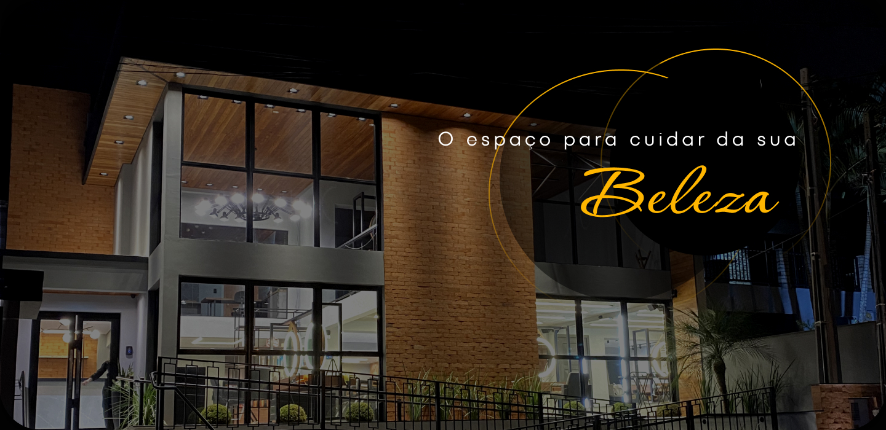

<h1 align="center"> Espaço Natural </h1>

Este repositório será utilizado como maneira de estudar. 

  

## 🚀 Tecnologias

Esse projeto foi desenvolvido com as seguintes tecnologias:

- HTML e CSS
- JavaScript
- Git e Github
- Figma
